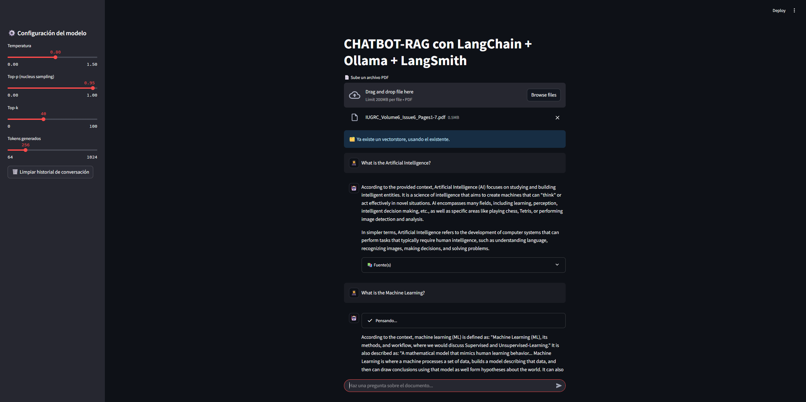
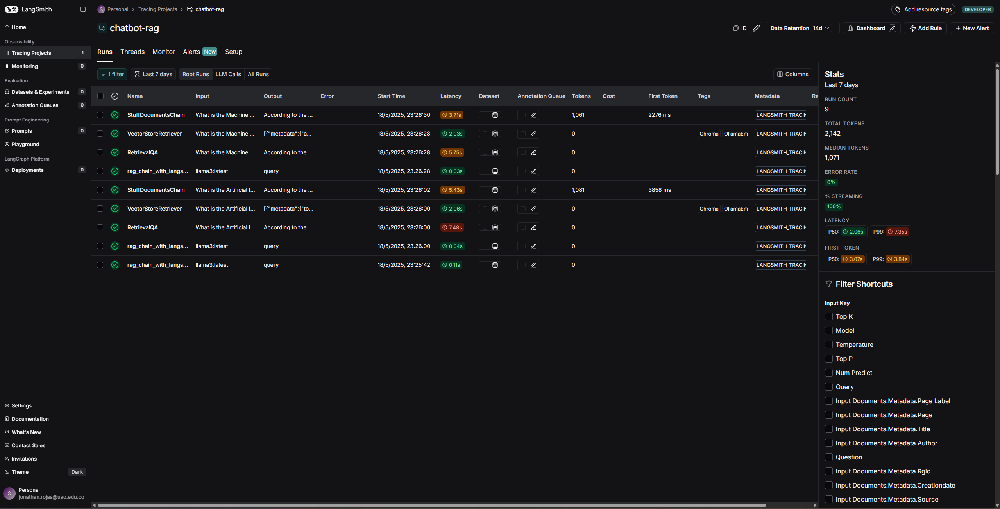
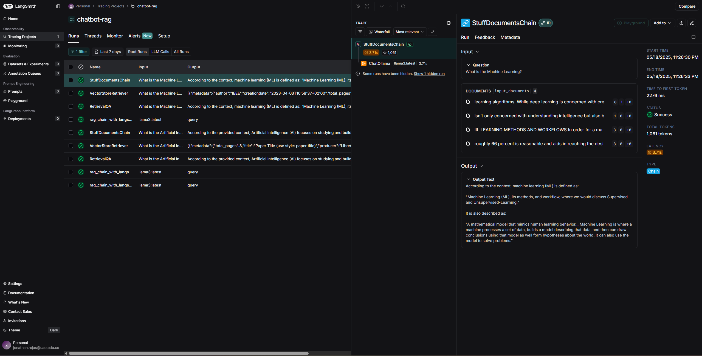

# 🤖 Chatbot RAG - Especialización en Inteligencia Artificial

Este proyecto consiste en un **chatbot inteligente basado en RAG (Retrieval-Augmented Generation)** que responde preguntas sobre el contenido de un documento PDF. Fue desarrollado como parte de la asignatura de la especialización en Inteligencia Artificial. Utiliza **LangChain**, **Ollama**, **ChromaDB**, **LangSmith**, y **Streamlit** para una experiencia profesional y trazable.

---

## 🔍 Tecnologías utilizadas

- [Streamlit](https://streamlit.io/) - Interfaz web
- [LangChain](https://www.langchain.com/) - Cadena RAG (recuperación + generación)
- [Ollama](https://ollama.com/) - Modelos LLM y de embeddings locales
- [ChromaDB](https://www.trychroma.com/) - Vector store persistente
- [LangSmith](https://smith.langchain.com/) - Monitoreo y trazabilidad de interacciones
- [uv](https://github.com/astral-sh/uv) - Gestor de dependencias para entorno reproducible

---

## 🧠 Arquitectura del chatbot

1. El usuario **carga un archivo PDF**.
2. El texto es extraído y **dividido en fragmentos** con `RecursiveCharacterTextSplitter`.
3. Cada fragmento se convierte en un vector usando **`nomic-embed-text`** desde Ollama.
4. Los vectores se almacenan en **ChromaDB** de forma persistente.
5. Cuando el usuario hace una pregunta, se usa RAG:
   - Se **recuperan** los fragmentos relevantes.
   - Un modelo LLM de Ollama genera una respuesta contextual.
6. Todo queda **registrado en LangSmith** para trazabilidad.

---

## 💻 Interfaz tipo ChatGPT

La interfaz fue desarrollada en Streamlit e incluye:

- Campo de entrada tipo `st.chat_input()`
- Mensajes estilo burbuja con `st.chat_message()`
- Avatares para usuario (🧑‍🎓) y bot (🤖)
- Respuestas simuladas en "streaming"
- Historial de conversación completo
- Configuración de `temperature`, `top_p`, `top_k`, `num_predict`
- Botón para limpiar el historial

---

## ⚙️ Instalación del entorno con uv

```bash
# Clona este repositorio
git clone https://github.com/jonathanrji/chatbot-rag.git
cd chatbot-rag

# Crea entorno virtual con uv
uv venv
source .venv/bin/activate   # o .venv\Scripts\activate en Windows

# Instala las dependencias
uv pip install
```

---

## 📁 Estructura del proyecto

```
chatbot-rag/
├── .venv/                 # Entorno virtual (ignorado por git)
├── .env                  # Variables de entorno privadas (no subir)
├── .gitignore            # Ignora entornos, pdfs, chroma_db, etc
├── data/                 # Archivos PDF cargados
├── chroma_db/            # Base vectorial persistente
├── pyproject.toml        # Definición de dependencias
├── src/
│   ├── app.py            # Interfaz Streamlit
│   ├── ingest.py         # Procesamiento del PDF
│   └── rag_chain.py      # Lógica del RAG con LangSmith
└── README.md
```

---

## 🔐 Variables de entorno

Crea un archivo `.env` con las siguientes claves:

```env
LANGCHAIN_API_KEY=tu_clave_langsmith
LANGCHAIN_PROJECT=chatbot-rag
LANGCHAIN_ENDPOINT=https://api.smith.langchain.com
LANGSMITH_TRACING=true
```

---

## ✍️ Ejemplo de uso

1. Ejecuta:
```bash
streamlit run src/app.py
```

2. Carga un archivo PDF (por ejemplo, un artículo técnico)

3. Pregunta algo como:
```
¿Cuál es el objetivo principal del documento?
```

4. El chatbot responde con información extraída y contextualizada.

---

## 📊 Captura de LangSmith

_Asegúrese de subir una imagen como esta en tu README:_

> 
> 
> 

Esto permite evidenciar el monitoreo en tiempo real del pipeline RAG.

---

## 🎥 Video demostrativo del chatbot

[](https://youtu.be/xF1HIOaEq0E)

---

## 📌 Conclusiones

Este proyecto demuestra la integración completa de las técnicas RAG con herramientas modernas como LangChain, Ollama, Chroma y LangSmith. La interfaz moderna y la configuración reproducible aseguran que el chatbot sea confiable, adaptable y transparente.

---

## 📚 Créditos

Proyecto desarrollado como parte de la **Especialización en Inteligencia Artificial** - Universidad Autónoma de Occidente.

Autor: Jonathan Rojas Ibáñez  
Fecha: 2024